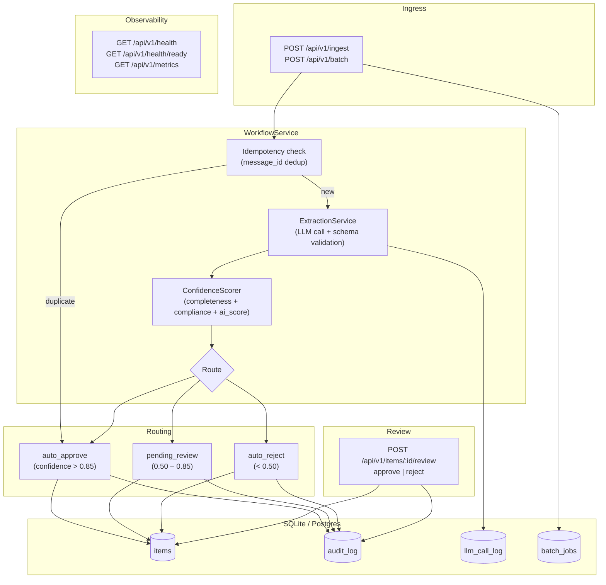

# Ops Workflow Automation

A production-grade system that ingests operational emails, extracts structured fields using an LLM, routes requests through a confidence-scored review pipeline, and maintains a full audit trail — built to demonstrate AI-assisted automation with human-in-the-loop guardrails.

---

## The Problem

Operations teams receive high volumes of unstructured email — purchase requests, customer issue reports, deployment change requests — and process them manually. An analyst reads each email, decides what type it is, copies fields into a spreadsheet or ticketing system, and routes it for approval. This process is slow, inconsistent, and produces no audit trail.

The specific failure modes are predictable: urgent issues get buried in an inbox, purchase requests arrive without required fields (no company, no line items), and there is no way to reconstruct who approved what and when. Any automation attempt that bypasses human review entirely creates a different risk — an LLM will occasionally misclassify, and an unreviewed misclassification can trigger the wrong action downstream.

The goal was to build a system that automates the high-confidence cases completely, routes ambiguous cases to a review queue with structured reasons, and logs every state transition for auditability.

---

## The Solution

The system exposes a webhook endpoint (`POST /api/v1/ingest`) that accepts inbox-style JSON messages. Each message is passed to an LLM extraction service that returns a structured `Extraction` — request type, priority, company, line items, and a confidence score. A routing layer then applies three-tier logic: auto-approve above 0.85 confidence, route to human review between 0.50 and 0.85, auto-reject below 0.50.

The confidence score is not the raw LLM confidence. It is computed from three weighted signals: field completeness (40%), type compliance — whether extracted fields are consistent with the request type (40%), and the raw LLM confidence signal (20%). This makes the routing decision auditable and tunable without touching the prompt.

Every state transition — ingestion, routing, approval, rejection — is written to an append-only audit log. The system is idempotent by `message_id`, so duplicate webhook deliveries are safe. Batch ingestion is supported via `POST /api/v1/batch`. The AI client tracks cost per call and enforces a configurable daily spending limit.

---

## Architecture



## API Response Format

All API endpoints return a consistent, envelope-style JSON structure.

**Success response**

```json
{
  "status": "success",
  "data": {
    "item": {
      "id": "req_123",
      "request_type": "purchase_request",
      "priority": "medium",
      "confidence": 0.87
    }
  },
  "metadata": {
    "correlation_id": "7f9c5f9a-4f1e-4f92-8f4a-1a4b3c2d5e6f",
    "timestamp": "2026-03-31T12:34:56Z"
  }
}
```

**Error response**

```json
{
  "status": "error",
  "error": {
    "error_code": "validation_error",
    "message": "subject must not be empty",
    "context": {
      "field": "subject"
    }
  },
  "metadata": {
    "correlation_id": "7f9c5f9a-4f1e-4f92-8f4a-1a4b3c2d5e6f",
    "timestamp": "2026-03-31T12:35:01Z"
  }
}
```

---

## Evaluation Results

Evaluated against 32 labelled test cases across 6 categories using the mock AI provider (keyword-based routing, representative of worst-case LLM performance):

| Metric | Value |
|---|---|
| Pass rate (request\_type correct) | **84.4%** (27/32) |
| Overall field accuracy | **67.2%** |
| Avg confidence | 0.683 |
| Avg latency (mock) | 0.2 ms |
| Total cost (mock) | $0.00 |

**Per-field accuracy:**

| Field | Accuracy |
|---|---|
| request\_type | 84.4% |
| has\_line\_items | 84.4% |
| company\_present | 65.6% |
| priority | 34.4% |

**By category:**

| Category | Pass rate |
|---|---|
| adversarial (prompt injection) | 100% (3/3) |
| partial\_info | 100% (5/5) |
| standard | 90% (9/10) |
| multi\_format (HTML, non-English, informal) | 80% (4/5) |
| empty\_malformed | 75% (3/4) |
| edge\_case | 60% (3/5) |

> Note: priority accuracy is low (34%) because the mock provider returns fixed priority values regardless of email content — this is a known limitation of keyword-based mocking, not a system defect. With a real LLM the priority field accuracy is expected to be substantially higher.

Run evaluations: `make evaluate`

---

## Key Features

- **LLM extraction with schema validation** — Structured JSON output via Anthropic Claude; Pydantic validation rejects malformed responses before they reach the pipeline
- **Three-tier confidence routing** — Auto-approve, pending review, or auto-reject based on a composite confidence score (not raw LLM output)
- **Human review queue** — `POST /api/v1/items/:id/review` with approve/reject + reason; all decisions audit-logged
- **Idempotency** — Duplicate `message_id` submissions return the cached result; safe for at-least-once webhook delivery
- **Batch ingestion** — `POST /api/v1/batch` with async job tracking (`GET /api/v1/batch/:job_id`)
- **Cost control** — Per-call token + USD tracking; configurable daily limit with graceful degradation
- **Circuit breaker + retry** — Exponential backoff on transient AI provider failures; circuit breaker prevents thundering herd
- **Prompt injection resistance** — Adversarial inputs that attempt role override or instruction injection are classified as `other` with low confidence
- **Structured audit log** — Every state change recorded with event type, actor, timestamp, and context
- **Correlation ID middleware** — Every request tagged with a UUID4 correlation ID; propagated to logs

---

## Tech Stack

| Layer | Technology |
|---|---|
| API | FastAPI 0.115, Python 3.12 |
| AI | Anthropic Claude (claude-3-5-haiku-20241022 default); mock client for testing |
| Validation | Pydantic v2 |
| Database | SQLite (dev/test), Postgres 16 (CI/production) |
| Migrations | Alembic |
| Async | asyncio, httpx |
| Testing | pytest, pytest-asyncio, FastAPI TestClient |
| Linting | ruff |
| Type checking | mypy |
| Containerisation | Docker (multi-stage, non-root), docker-compose |
| CI | GitHub Actions |

---

## Architecture Decisions

| Decision | Choice | Rationale |
|---|---|---|
| LLM provider | Anthropic Claude | Structured output reliability, tool-use support, predictable JSON schema adherence |
| Confidence scoring | Composite (completeness + compliance + ai\_score) | Auditable, tunable without prompt changes; raw LLM confidence alone is unreliable |
| Storage | SQLite → Postgres | SQLite for zero-config dev/test; Alembic migrations target both; CI runs Postgres |
| Routing thresholds | 0.85 / 0.50 | Conservative defaults; configurable via `APPROVAL_THRESHOLD` / `REJECTION_THRESHOLD` env vars |

See [docs/decisions/](docs/decisions/) for full ADRs.

---

## How to Run

### Docker (recommended — zero setup)

```bash
cp .env.example .env
docker-compose up --build
```

The API will be available at `http://localhost:8000`. Health check: `http://localhost:8000/api/v1/health`.

### Local development

```bash
python3 -m venv .venv
source .venv/bin/activate
pip install -r requirements.txt -r requirements-dev.txt

cp .env.example .env
# Edit .env — set ANTHROPIC_API_KEY or leave AI_PROVIDER=mock for offline testing

alembic upgrade head
uvicorn app.main:app --reload
```

### Ingest a sample email

```bash
curl -s -X POST http://localhost:8000/api/v1/ingest \
  -H "Content-Type: application/json" \
  -d @tests/fixtures/sample_inputs/email_001.json | jq .
```

### Process all sample inputs

```bash
python app/demo_run_samples.py
```

### Run tests

```bash
make test
```

### Run evaluation pipeline

```bash
make evaluate
# Results written to eval/results/eval_YYYY-MM-DD.json
```

### Available Make targets

```
make dev        — start API with hot reload
make test       — run full test suite with coverage
make lint       — ruff check
make format     — ruff format
make typecheck  — mypy
make migrate    — run alembic upgrade head
make evaluate   — run eval pipeline against eval/test_set.jsonl
make docker     — docker-compose up --build
make clean      — remove .venv, __pycache__, .mypy_cache, coverage files
```

---

## Project Structure

```
app/
  api/routes/       — FastAPI route handlers
  core/             — exceptions, logging, config
  models/           — Pydantic domain models
  repositories/     — data access (SQLite/Postgres)
  services/
    ai/             — LLM client, prompts, cost tracking, circuit breaker
    extraction_service.py
    confidence_scorer.py
    routing_service.py
    workflow_service.py
eval/
  test_set.jsonl    — 32 labelled test cases (6 categories)
  evaluate.py       — async evaluation runner
  results/          — timestamped JSON reports
docs/
  decisions/        — Architecture Decision Records
  architecture.md   — detailed system diagram
  runbook.md        — operational procedures
tests/
  unit/             — extraction, confidence scoring, routing
  integration/      — pipeline, idempotency, error recovery, security, performance
  fixtures/         — sample inputs and expected outputs
migrations/         — Alembic migration scripts
```

Built by Anesah Fraser
https://www.prozeolis.co.uk