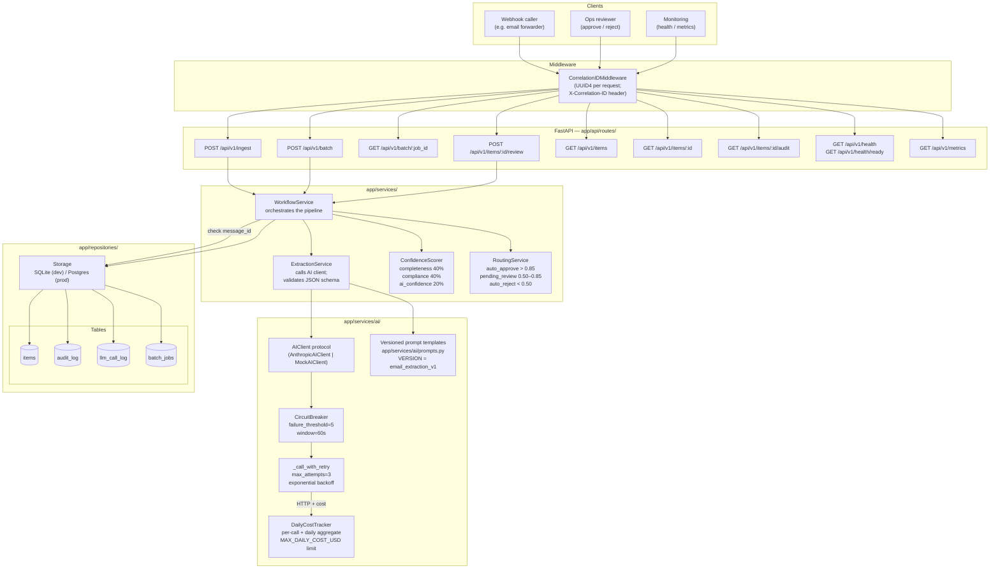
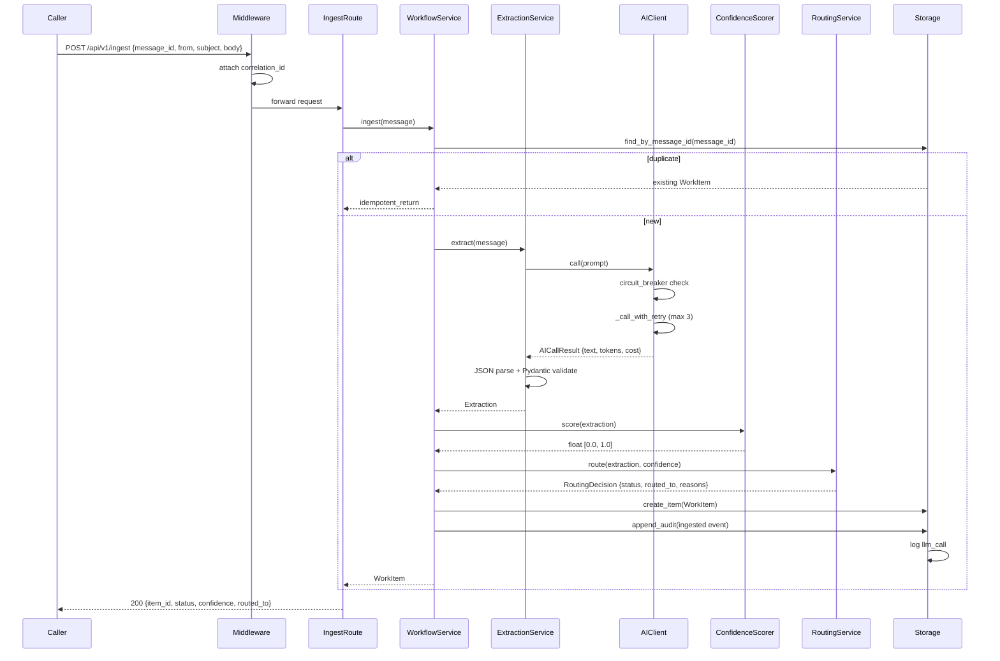
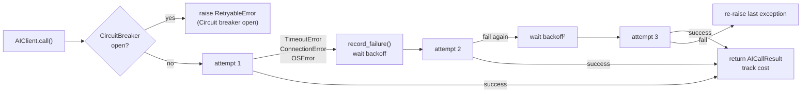
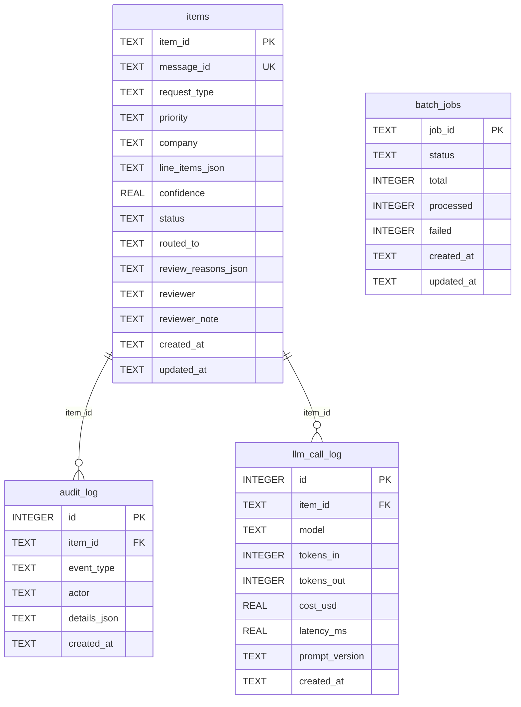
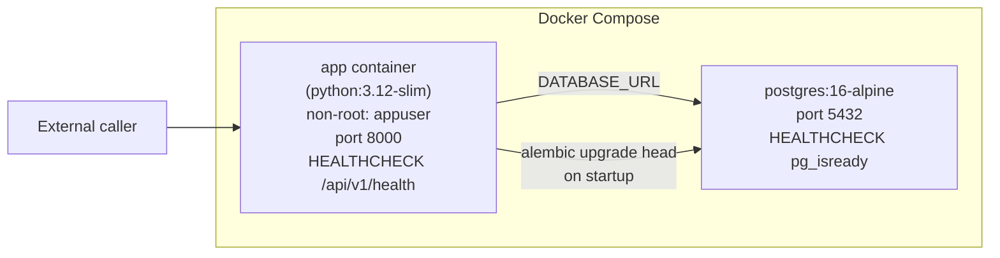

# System Architecture

## Overview

The ops workflow automation system is a FastAPI service that ingests unstructured email messages, extracts structured fields via an LLM, routes items through a confidence-scored pipeline, and maintains a full audit trail. It is designed for at-least-once webhook delivery (idempotent by `message_id`) and supports both synchronous single-item ingestion and asynchronous batch processing.

---

## Full System Diagram



---

## Request Flow — Single Ingest



---

## Confidence Scoring

The composite confidence score is computed from three weighted components:

```
confidence = (completeness × 0.40) + (type_compliance × 0.40) + (ai_confidence × 0.20)
```

**Completeness** — fraction of expected fields present for the request type:
- `purchase_request`: expects company + line_items + priority
- `customer_issue`: expects company + priority
- `ops_change`: expects priority
- `other`: no required fields (completeness = 0.5 baseline)

**Type compliance** — checks that extracted fields are consistent with the request type:
- Purchase requests should have line items
- Customer issues should have a company (penalised if absent)
- Penalises when line items appear on non-purchase types

**AI confidence** — the raw confidence value returned by the LLM in its JSON response, clamped to [0.0, 1.0].

---

## Routing Thresholds

| Score range | Decision | Rationale |
|---|---|---|
| > 0.85 | auto\_approve | High completeness + type consistency; safe to process without review |
| 0.50 – 0.85 | pending\_review | Missing fields or borderline type; human review required |
| < 0.50 | auto\_reject | Insufficient information to act on; caller should resend with more detail |

Thresholds are configurable via `APPROVAL_THRESHOLD` and `REJECTION_THRESHOLD` in Settings.

---

## AI Client Resilience



- Base delay: 1.0s (overridable in tests via `base_delay=0.0`)
- Backoff multiplier: 2× per attempt
- Circuit breaker opens after 5 failures within a 60-second window
- Daily cost limit enforced before each AI call; `CostLimitExceeded` raised if exceeded

---

## Data Model



---

## Deployment



Multi-stage Dockerfile: builder stage installs dependencies; runtime stage copies only the installed packages. Non-root `appuser` with UID 1001. Health check polls `/api/v1/health` every 30s.
